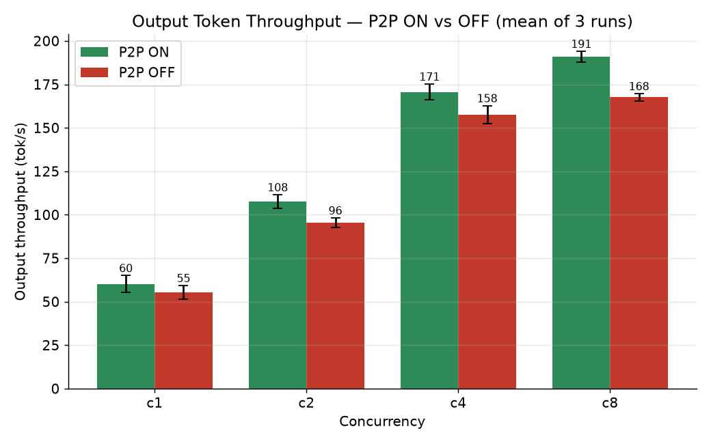
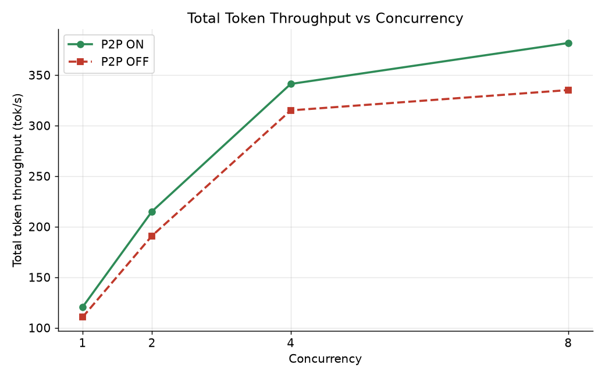
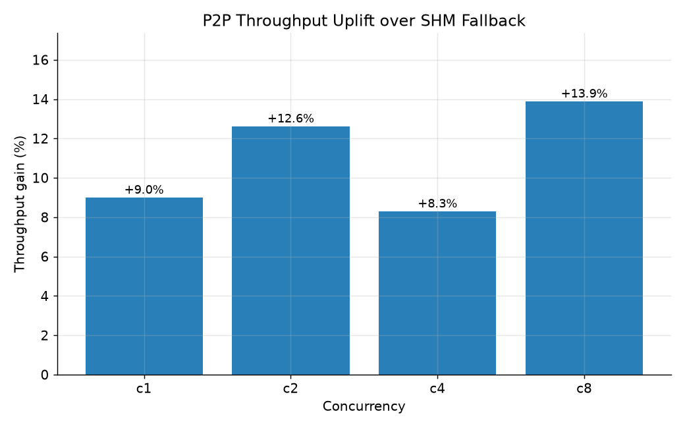
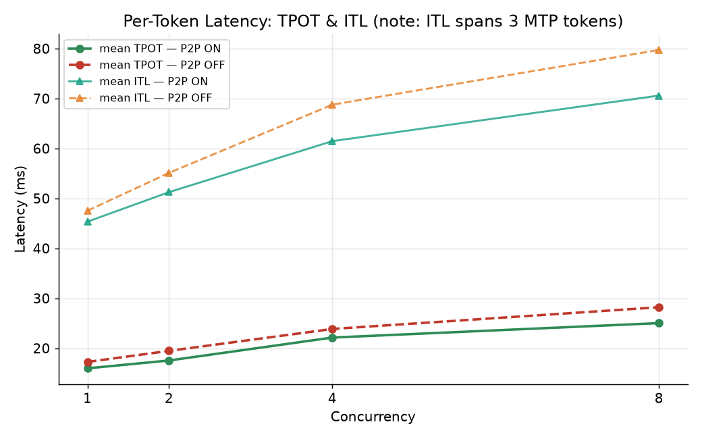
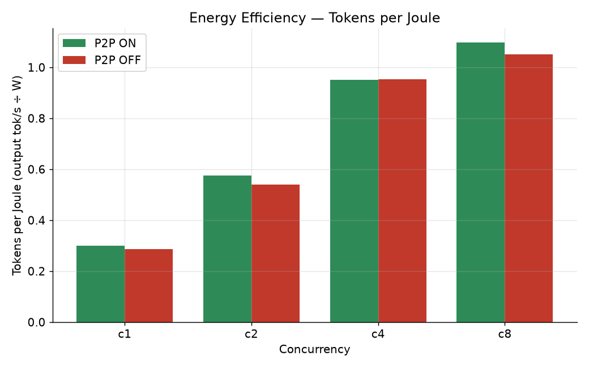
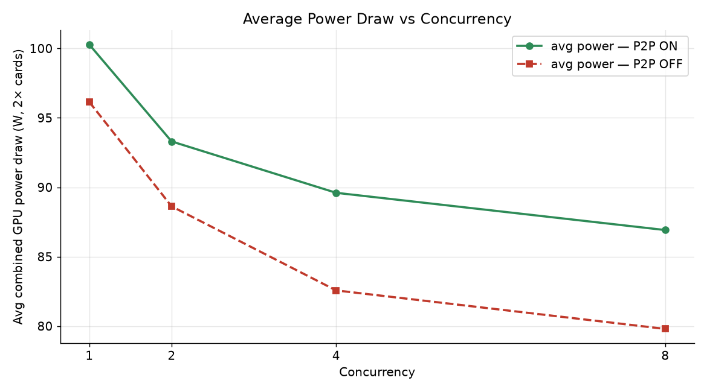
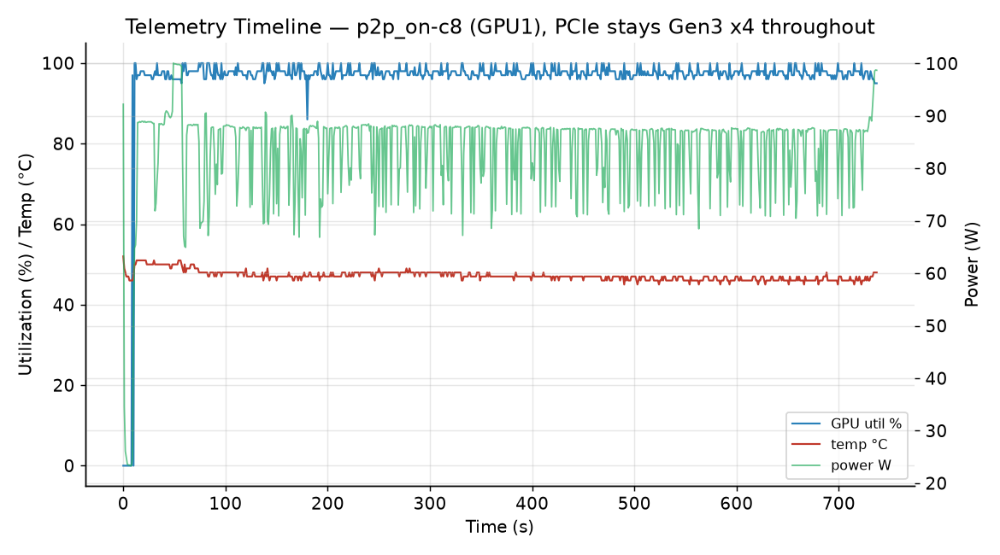

# Budget Dual RTX 5060 Ti — NVIDIA P2P On vs Off Inference Benchmark

A reproducible benchmark of **NVIDIA peer-to-peer (P2P) on vs off** for tensor-parallel
LLM inference on a pair of **consumer RTX 5060 Ti (16 GB)** cards, running
[`Qwen3.6-27B-Text-NVFP4-MTP`](https://huggingface.co/sakamakismile/Qwen3.6-27B-Text-NVFP4-MTP)
under vLLM with **NCCL `cuMem` P2P transport**.

Each scenario was measured at **concurrency 1, 2, 4, and 8**, with **3 iterations per arm**
in an interleaved **AB‑AB‑AB** schedule (P2P_ON run, then P2P_OFF run, repeated 3×) to
average out thermal drift and run-to-run noise.

> **TL;DR** — On a Gen3 x4 link per card, enabling consumer-GPU P2P delivers a consistent
> **+8% to +14%** output-throughput uplift across all tested concurrencies, with **lower
> latency** and **better tokens-per-joule**. For a single-user inference box that rarely
> exceeds ~4–5 concurrent requests, this $1,000-of-GPU build is a genuinely viable setup.

> 📑 **Every substantive claim in this report is backed by data.** See the
> **[Evidence Appendix](evidence.md)** — each claim there links to the source file *and*
> shows the exact excerpt that supports it. Throughout this page, **[ⓘ evidence](evidence.md)**
> links jump you straight to the relevant proof. (Raw-data links open the files in the
> [GitHub repository](https://github.com/joorklee/p2p-bench); the Evidence Appendix and
> charts are part of this site.)

---

## Credits & resources

I did **not** figure this out in a vacuum. Huge thanks to the following — these are the
resources I leaned on to get consumer-GPU P2P working and to design this rig:

- **[r/LocalLLM — "Quad 5060 Ti 16GB OCuLink rig"](https://www.reddit.com/r/LocalLLM/comments/1qfctk3/quad_5060_ti_16gb_oculink_rig/)**
  — the major inspiration for this whole build.
- **[`5p00kyy/club-5060ti`](https://github.com/5p00kyy/club-5060ti/)** — the club-5060ti
  repo: invaluable reference for running multi-5060-Ti setups.
- **[`aikitoria/open-gpu-kernel-modules`](https://github.com/aikitoria/open-gpu-kernel-modules)**
  — the patched NVIDIA open GPU kernel modules that enable P2P on consumer GeForce cards.
  This is the driver that makes the "P2P ON" arm of this benchmark possible.
- **Model:** [`sakamakismile/Qwen3.6-27B-Text-NVFP4-MTP`](https://huggingface.co/sakamakismile/Qwen3.6-27B-Text-NVFP4-MTP)
  on Hugging Face — the NVFP4 + MTP model served throughout.

---

## Table of Contents

1. [Results at a glance](#results-at-a-glance)
2. [Throughput](#throughput)
3. [P2P uplift](#p2p-uplift)
4. [Latency — and the MTP caveat](#latency--and-the-mtp-caveat)
5. [Energy efficiency](#energy-efficiency)
6. [Proof that P2P is actually being used](#proof-that-p2p-is-actually-being-used)
7. [PCIe link state — why this is Gen3 x4 (and not Gen4)](#pcie-link-state--why-this-is-gen3-x4-and-not-gen4)
8. [What the telemetry tells us](#what-the-telemetry-tells-us)
9. [Is P2P even worth it for *my* use case?](#is-p2p-even-worth-it-for-my-use-case)
10. [System, driver & patched kernel-module details](#system-driver--patched-kernel-module-details)
11. [Boot, GRUB & sysctl tuning captured at runtime](#boot-grub--sysctl-tuning-captured-at-runtime)
12. [Cost breakdown — why this is a budget build](#cost-breakdown--why-this-is-a-budget-build)
13. [Reproduce it yourself](#reproduce-it-yourself)
14. [Future work](#future-work)
15. [About me & a request](#about-me--a-request)
16. [Raw data index](#raw-data-index)
17. [Evidence Appendix (claim-by-claim proof)](evidence.md)
18. [Credits & resources](#credits--resources)

---

## Results at a glance

Model: [`Qwen3.6-27B-Text-NVFP4-MTP`](https://huggingface.co/sakamakismile/Qwen3.6-27B-Text-NVFP4-MTP)
(NVFP4 weights, MTP speculative decode, 3 spec tokens)
· `tensor-parallel-size=2` · `kv-cache-dtype=fp8` · `max-model-len=65535` ·
`max-num-batched-tokens=16384` · `gpu-memory-utilization=0.86` ·
`attention-backend=TRITON_ATTN` · `disable-custom-all-reduce` · NCCL 2.28.9 ·
`NCCL_CUMEM_ENABLE=1`.

All figures are the **mean of 3 runs**. Throughput in **tokens/sec**, latency in **ms**.
Config evidence: [ⓘ model/MTP](evidence.md#c1-model-config) ·
[ⓘ vLLM args](evidence.md#c2-vllm-args) · [ⓘ devices](evidence.md#c3-devices). Results
evidence: [ⓘ throughput](evidence.md#c11-throughput) · [ⓘ latency/MTP](evidence.md#c13-itl-mtp) ·
[ⓘ power](evidence.md#c14-power).

| Concurrency | Arm | Output tok/s | Total tok/s | mean TTFT (ms) | mean TPOT (ms) | p99 TPOT (ms) | mean ITL (ms) | Avg power (W) | tok/J |
|---|---|---|---|---|---|---|---|---|---|
| 1 | **P2P ON**  | **60.3 ±4.8** | 120.6 | 742  | 16.0 | 26.6 | 45.4 | 201 | 0.301 |
| 1 | P2P OFF     | 55.3 ±4.0     | 110.6 | 945  | 17.3 | 30.4 | 47.5 | 192 | 0.287 |
| 2 | **P2P ON**  | **107.6 ±4.0**| 215.2 | 890  | 17.6 | 32.5 | 51.3 | 187 | 0.577 |
| 2 | P2P OFF     | 95.5 ±2.7     | 191.1 | 1062 | 19.5 | 42.0 | 55.1 | 177 | 0.539 |
| 4 | **P2P ON**  | **170.6 ±4.6**| 341.3 | 985  | 22.1 | 46.5 | 61.5 | 179 | 0.952 |
| 4 | P2P OFF     | 157.6 ±5.2    | 315.1 | 1179 | 23.9 | 45.6 | 68.8 | 165 | 0.954 |
| 8 | **P2P ON**  | **190.9 ±3.2**| 381.8 | 16463| 25.0 | 62.5 | 70.6 | 174 | 1.098 |
| 8 | P2P OFF     | 167.6 ±2.1    | 335.2 | 18640| 28.2 | 71.3 | 79.7 | 160 | 1.050 |

**P2P output-throughput uplift:** `c1 +9.0%` · `c2 +12.6%` · `c4 +8.3%` · `c8 +13.9%`.
[ⓘ evidence](evidence.md#c12-uplift)

> **How to read these numbers (caveats up front):**
> - **n = 3** per scenario. The `±` is the std-dev across those 3 interleaved (AB-AB-AB)
>   reps. With only 3 samples there's real run-to-run variance — e.g. the c1 P2P-on runs
>   were `[64.0, 63.3, 53.5]` tok/s — so treat the smaller deltas (c1, c4) as *suggestive*
>   and the larger, lower-variance ones (c2, c8) as more solid. The **direction** (P2P on ≥
>   off) is consistent across all four. [ⓘ raw per-run values](evidence.md#c11-throughput)
> - **`tok/J` uses board power** (`nvidia-smi power.draw` summed over both cards), **not
>   wall power** — so it excludes CPU/PSU/idle-rail overhead and is a GPU-relative figure.
> - **MTP makes absolute tok/s workload-dependent.** Inputs are fixed-length and
>   deterministic so the *P2P delta* is apples-to-apples, but the absolute throughput won't
>   match a real chat trace. See the [MTP caveat](#latency--and-the-mtp-caveat) for ITL.
> - **TTFT at c8 is ~16–18 s** because 16×8 = 128 fixed-length prompts are submitted at once
>   against `max-num-seqs=8`, so most requests queue — that's queueing latency, not
>   first-token compute. TPOT/throughput are the meaningful c8 metrics.
> - **This is n = 1 *system*.** One rig, one model, one driver build, one PCIe link state
>   (Gen3 x4). The P2P delta here shouldn't be assumed to generalize to other GPUs, link
>   widths, models, or NCCL/driver versions — it's a data point for *this* configuration, not
>   a universal claim. The [future-work runs](#future-work) (Gen4, 4-card) are intended to
>   broaden it.

---

## Throughput

P2P ON wins at every concurrency level. Error bars are the std-dev across the 3 iterations.
[ⓘ evidence: throughput data](evidence.md#c11-throughput)





---

## P2P uplift

The relative gain from enabling consumer-GPU P2P over the NCCL **SHM (shared-host-memory)**
fallback path. Even on a modest Gen3 x4 link the all-reduce traffic in TP=2 benefits.
[ⓘ evidence: uplift figures](evidence.md#c12-uplift)



---

## Latency — and the MTP caveat



> ### ⚠️ Important note about the latency metric and MTP
>
> This model runs with **Multi-Token Prediction (MTP)** speculative decoding configured
> with **3 speculative tokens** (`speculative-config={"method":"mtp","num_speculative_tokens":3}`).
>
> Because of this, the **ITL (Inter-Token Latency)** number is *not* directly comparable to
> the ITL you'd read on a non-MTP model. On a normal (non-speculative) model, the per-token
> latency metric measures the time to emit a **single** token. With MTP and 3 spec tokens,
> the engine proposes/verifies a block of up to **3 tokens at once**, so the measured
> inter-token interval reflects the time **between completing a whole batch of those 3
> speculation tokens** — not a single token. That makes the **mean ITL (~45–80 ms)** look
> much "higher/more latent" than people may expect, when in reality the *effective*
> per-emitted-token time is materially lower (and is better reflected by **TPOT**, which is
> in the **16–28 ms** range here). If you're comparing this build against a non-MTP setup,
> compare **TPOT** and **output tok/s**, and treat **ITL** as a per-speculation-block metric.
>
> [ⓘ evidence: MTP config & ITL-vs-TPOT numbers](evidence.md#c13-itl-mtp)

---

## Energy efficiency

Tokens-per-joule = output tok/s ÷ mean combined GPU power. P2P ON is equal-or-better at
every concurrency, and the whole rig tops out around **174–201 W for both cards combined**.
[ⓘ evidence: power & tokens/joule](evidence.md#c14-power)





---

## Proof that P2P is actually being used

This is the part that matters: P2P being "enabled" isn't the same as P2P being **used**.
The benchmark captured a `transport_proof.json` for every scenario by parsing the live
NCCL debug logs, and the `cuMem` (`NCCL_CUMEM_ENABLE=1`) allocator path is what makes
direct peer mapping work on these consumer cards ([ⓘ evidence](evidence.md#c9-cumem)).

**P2P ON** — NCCL maps channels directly over the bus via the cuMem allocator
(`via P2P/CUMEM`), with `nccl_used_p2p: true`, `nccl_used_shm: false`
([ⓘ evidence](evidence.md#c5-p2p-used)):

```
proxmox:1417089 [1] NCCL INFO NCCL_CUMEM_ENABLE set by environment to 1.
proxmox:1417089 [1] NCCL INFO Check P2P Type isAllDirectP2p 1 directMode 0 isAllCudaP2p 1
proxmox:1417089 [1] NCCL INFO Channel 00/0 : 1[2] -> 0[1] via P2P/CUMEM
proxmox:1417088 [0] NCCL INFO Channel 00/0 : 0[1] -> 1[2] via P2P/CUMEM
```

**P2P OFF** — same `cuMem` allocator, but with `NCCL_P2P_DISABLE=1` NCCL falls back to the
shared-host-memory staging path (`via SHM/direct/direct`), `nccl_used_p2p: false`
([ⓘ evidence](evidence.md#c6-shm-fallback)):

```
proxmox:1495819 [0] NCCL INFO NCCL_P2P_DISABLE set by environment to 1
proxmox:1495819 [0] NCCL INFO Check P2P Type isAllDirectP2p 0 directMode 0 isAllCudaP2p 1
proxmox:1495819 [0] NCCL INFO Channel 00 : 0[1] -> 1[2] via SHM/direct/direct
```

The CUDA P2P bandwidth/latency sample (captured in
[`p2p_evidence.json`](https://github.com/joorklee/p2p-bench/blob/main/p2p-bench/results/2026-06-16_5060ti-16gb_2cards_gen3-x4_p2p-sweep-c1-2-4-8/env/p2p_evidence.json)) confirms the two 5060 Ti's
(devices 1 & 2) **CAN access each other** as peers ([ⓘ evidence](evidence.md#c7-peer-access)),
and that P2P writes cut the inter-GPU latency dramatically (e.g. `18.08 µs → 0.42 µs` on the
GPU1↔GPU2 path once P2P is enabled — [ⓘ evidence](evidence.md#c8-latency-drop)).

> ### ⚠️ "But the cuda-samples *bandwidth* is the same with P2P on and off — isn't that the red flag that P2P isn't engaging?"
>
> Fair question, and worth addressing head-on because this harness's own README says *"if
> P2P=Enabled bandwidth ≈ P2P=Disabled, P2P is not engaging."* In the
> [`p2pBandwidthLatencyTest`](evidence.md#c8-latency-drop) output, the GPU1↔GPU2 **bandwidth**
> is indeed ~3.5 GB/s in *both* the disabled and enabled matrices — but that is expected
> here and is **not** evidence that P2P is off, for two reasons:
>
> 1. **The link is the ceiling, not P2P.** PCIe **Gen3 x4 ≈ 3.9 GB/s** one-way (see the
>    PCIe section below). The ~3.5 GB/s measured is essentially that link saturated. P2P
>    writes don't *raise* the ceiling of a host-bridge (`PHB`) PCIe path — they remove the
>    host-memory bounce, which shows up as **latency**, not peak bandwidth. And the latency
>    *does* collapse (**18.08 µs → 0.42 µs**), which is exactly the P2P signature.
> 2. **The transport is proven independently.** The "red flag" rule is about the *torch/
>    cuda-samples* bandwidth probe being the *only* signal. Here we don't rely on it — the
>    NCCL channel-init logs explicitly show **`via P2P/CUMEM`** (P2P on) vs
>    **`via SHM/direct/direct`** (P2P off), parsed into `transport_proof.json`
>    (`nccl_used_p2p: true` vs `false`). That is direct, unambiguous proof that the two arms
>    use different transports — which is what actually matters for the benchmark.
>
> So the equal *bandwidth* is the link speaking, while the latency drop **and** the NCCL
> transport proof are what establish P2P is genuinely engaging.

You can verify all of this yourself (data lives under
[`p2p-bench/results/2026-06-16_5060ti-16gb_2cards_gen3-x4_p2p-sweep-c1-2-4-8/`](https://github.com/joorklee/p2p-bench/blob/main/p2p-bench/results/2026-06-16_5060ti-16gb_2cards_gen3-x4_p2p-sweep-c1-2-4-8/)):

- Per-scenario transport proof: [`scenarios/p2p_on-c1/transport_proof.json`](https://github.com/joorklee/p2p-bench/blob/main/p2p-bench/results/2026-06-16_5060ti-16gb_2cards_gen3-x4_p2p-sweep-c1-2-4-8/scenarios/p2p_on-c1/transport_proof.json) vs [`scenarios/p2p_off-c1/transport_proof.json`](https://github.com/joorklee/p2p-bench/blob/main/p2p-bench/results/2026-06-16_5060ti-16gb_2cards_gen3-x4_p2p-sweep-c1-2-4-8/scenarios/p2p_off-c1/transport_proof.json)
- Raw NCCL logs: [`logs/p2p_on-c1.log`](https://github.com/joorklee/p2p-bench/blob/main/p2p-bench/results/2026-06-16_5060ti-16gb_2cards_gen3-x4_p2p-sweep-c1-2-4-8/logs/p2p_on-c1.log) · [`logs/p2p_off-c1.log`](https://github.com/joorklee/p2p-bench/blob/main/p2p-bench/results/2026-06-16_5060ti-16gb_2cards_gen3-x4_p2p-sweep-c1-2-4-8/logs/p2p_off-c1.log)
- Full P2P evidence dump: [`env/p2p_evidence.json`](https://github.com/joorklee/p2p-bench/blob/main/p2p-bench/results/2026-06-16_5060ti-16gb_2cards_gen3-x4_p2p-sweep-c1-2-4-8/env/p2p_evidence.json)

---

## PCIe link state — why this is Gen3 x4 (and not Gen4)

Every telemetry sample across all 8 scenarios reports the **same PCIe link state for both
5060 Ti's**:

| Field | Value |
|---|---|
| `pcie.link.gen.current` | **3** |
| `pcie.link.gen.max` | 3 (as negotiated/reported under this topology) |
| `pcie.link.width.current` | **x4** |
| `pcie.link.width.max` | x16 (slot/root-port max — see note below) |

So during this run **each RTX 5060 Ti was running at PCIe Gen3 x4** — i.e. **4 lanes**
per card over OCuLink.

> **A note on `width.max = x16`:** that field reports the **slot/root-port** maximum, not
> the GPU's own capability. The RTX 5060 Ti is physically a **PCIe x8** device, so its real
> ceiling on this platform is x8 — and over the OCuLink adapter it negotiated **x4**. If
> anything this *strengthens* the takeaway below: these cards never needed x16 lanes for
> inference, and x4 was not the bottleneck.

This is the link state recorded directly in
the [`telemetry.csv`](https://github.com/joorklee/p2p-bench/blob/main/p2p-bench/results/2026-06-16_5060ti-16gb_2cards_gen3-x4_p2p-sweep-c1-2-4-8/scenarios/p2p_on-c8/telemetry.csv) files
([ⓘ evidence](evidence.md#c15-gen3x4)) and confirmed live via `nvidia-smi` on the host
([ⓘ evidence](evidence.md#c16-host-link)).

> ### ⚙️ Gen4 wasn't achievable on this run — and I'm troubleshooting it
>
> I was targeting **Gen4 x4** over OCuLink, but the link trained down to **Gen3** for this
> benchmark. I believe this is a signal-integrity / cable-length issue on the OCuLink path
> (it currently needs a retimer at the present cable length). I'm actively troubleshooting
> it. The good news: because this is *inference-only*, the inter-GPU all-reduce volume is
> small, so even Gen3 x4 still shows a clean P2P win (see below). See
> [Future work](#future-work) for the Gen4 / 4-card plans.

---

## What the telemetry tells us

Each scenario logged `nvidia-smi` telemetry once per second across all 3 iterations
(`telemetry.csv`, `telemetry_run2.csv`, `telemetry_run3.csv`). Fields:
`pcie.link.gen.current/max`, `pcie.link.width.current/max`, `temperature.gpu`,
`utilization.gpu`, `utilization.memory`, `memory.used`, `power.draw`,
`clocks.current.sm`, `clocks.current.memory`.

Aggregated per scenario (both 5060 Ti's, all 3 iterations combined):

| Scenario | PCIe | Width | Max temp °C | Avg temp °C | Max GPU util % | Avg util % | Peak power (per card) | Avg power | Max mem used (MiB) | Max SM clock (MHz) |
|---|---|---|---|---|---|---|---|---|---|---|
| p2p_off-c1 | Gen3 | x4 | 63 | 53 | 100 | 94 | 106 | 96  | 13921 | 2812 |
| p2p_off-c2 | Gen3 | x4 | 63 | 53 | 100 | 95 | 104 | 89  | 14103 | 2812 |
| p2p_off-c4 | Gen3 | x4 | 62 | 52 | 100 | 96 | 104 | 83  | 14661 | 2827 |
| p2p_off-c8 | Gen3 | x4 | 63 | 51 | 100 | 97 | 104 | 80  | 14793 | 2820 |
| p2p_on-c1  | Gen3 | x4 | 64 | 55 | 100 | 94 | 109 | 100 | 13935 | 2812 |
| p2p_on-c2  | Gen3 | x4 | 63 | 53 | 100 | 94 | 109 | 93  | 14127 | 2812 |
| p2p_on-c4  | Gen3 | x4 | 63 | 53 | 100 | 95 | 108 | 90  | 14647 | 2812 |
| p2p_on-c8  | Gen3 | x4 | 64 | 52 | 100 | 96 | 108 | 87  | 14779 | 2812 |

Sample timeline (p2p_on-c8, GPU1) — utilization, temperature and power over the run:



**What we can glean:**

- **Temperature:** Rock-solid and cool. Peaks at **62–64 °C**, averaging **~51–55 °C**.
  These cards are nowhere near thermal limits — no throttling is happening, so the
  throughput numbers are not thermally constrained. [ⓘ evidence](evidence.md#c17-temp)
- **PCIe link:** Pinned at **Gen3 x4** the entire time, in every single scenario. This is
  the *baseline* we're benchmarking against, and why the Gen4 follow-up matters.
  [ⓘ evidence](evidence.md#c15-gen3x4)
- **GPU utilization:** **94–97 % average**, frequently hitting **100 %**. The GPUs are the
  bottleneck (compute-bound), which is exactly what you want — the PCIe link is *not*
  saturating at these inference concurrencies. [ⓘ evidence](evidence.md#c18-util)
- **Power:** Peak **~104–109 W per card**, averaging **~80–100 W**. Note the average power
  *drops* as concurrency rises (96 W → 80 W at c8) because more time is spent in batched
  compute and less in idle gaps between requests — and the rig as a whole stays well under
  the cards' rated TGP. **Both cards combined draw under ~210 W** in the worst case.
  [ⓘ evidence](evidence.md#c19-power-detail)
- **Memory:** Up to **~14.8 GiB used** per card at c8 — comfortably inside the 16 GB
  budget at `max-model-len=65535` and `max-num-batched-tokens=16384`.
  [ⓘ evidence](evidence.md#c20-mem)
- **SM clocks:** Steady **~2.8 GHz**, consistent with no throttling.
  [ⓘ evidence](evidence.md#c21-clocks)

Raw per-scenario power summaries are in each scenario's
[`power_run*.json`](https://github.com/joorklee/p2p-bench/blob/main/p2p-bench/results/2026-06-16_5060ti-16gb_2cards_gen3-x4_p2p-sweep-c1-2-4-8/scenarios/p2p_on-c8/power_run1.json) and the full telemetry CSVs
are linked in the [Raw data index](#raw-data-index).

---

## Is P2P even worth it for *my* use case?

**My use case is pure inference** — no fine-tuning, no training, no gradient all-reduce,
no multi-GPU optimizer state syncing. It's just serving a single quantized model with TP=2.

As a **single user**, my realistic concurrency rarely climbs above **4–5 simultaneous
requests**, and almost never higher. The benchmark deliberately brackets that:
**c1, c2, c4, c8**.

Here's the key insight from the data: at inference time the only meaningful inter-GPU
traffic is the **tensor-parallel all-reduce** of activations between layers. That's small
and bursty compared to training. The telemetry backs this up — the GPUs sit at **94–97 %
utilization** while the **PCIe Gen3 x4 link never becomes the bottleneck**. If the link were
saturating, P2P-vs-SHM would show a *much* larger gap and utilization would dip; instead we
see a modest-but-consistent **+8–14 %** improvement that comes from cutting the host-memory
staging hop (and the ~18 µs → sub-µs peer latency), not from raw bandwidth.

**Conclusion: for single-user, inference-only workloads at ≤ ~5 concurrency, the P2P
bandwidth requirement is minimal, and even a Gen3 x4 link is more than enough — which makes
this dual-5060-Ti setup very viable.** P2P still helps (free 8–14 %), it just isn't
*bandwidth-starved*.

> *(If you think this reasoning is wrong or incomplete — e.g. if you have data showing the
> link does become a bottleneck at higher batch sizes or longer contexts — please
> [open an issue](https://github.com/joorklee/p2p-bench/issues); I'd genuinely like to be corrected.)*

---

## System, driver & patched kernel-module details

### Hardware

Hardware evidence: [ⓘ CPU/RAM/OS/kernel](evidence.md#c26-hardware) ·
[ⓘ devices & topology](evidence.md#c3-devices).

| Component | Spec |
|---|---|
| Motherboard | ASUS TUF Gaming X570-Plus (Wi-Fi) |
| CPU | AMD Ryzen 9 3900X (12C / 24T) |
| RAM | 64 GB DDR4 @ 2133 MT/s (SPD/`dmidecode`) |
| GPUs (under test) | 2× NVIDIA GeForce RTX 5060 Ti **16 GB** (devices 1 & 2, bus `09:00.0` / `0A:00.0`) |
| Other GPU present | 1× RTX 5070 (device 0, bus `04:00.0`) — **not** used in this benchmark (`CUDA_VISIBLE_DEVICES=1,2`) |
| GPU interconnect | PCIe Gen3 **x4** per card over OCuLink (topology `PHB` — traverses the PCIe host bridge; no NVLink) |
| Host OS | Proxmox VE on Debian 13 (trixie), kernel `6.17.13-13-pve` |

The two 5060 Ti's connect peer-to-peer through the CPU's PCIe host bridge (`PHB` in the
`nvidia-smi topo` matrix) — there is no NVLink on these cards, so PCIe P2P is the only direct
path, which is exactly what this benchmark exercises. [ⓘ evidence](evidence.md#c10-topo)

### NVIDIA driver & the patched P2P kernel modules

Consumer GeForce cards don't expose P2P with the stock driver. To enable it I built the
community **open GPU kernel modules with the P2P patch** — specifically
[`aikitoria/open-gpu-kernel-modules`](https://github.com/aikitoria/open-gpu-kernel-modules)
(the geohot/tinygrad-style P2P enablement, extended for the RTX 5090/Blackwell generation),
checked out on the Proxmox host at **`/data/open-gpu-kernel-modules`**. Evidence:
[ⓘ base driver 595.71.05](evidence.md#c22-driver) ·
[ⓘ patched module repo](evidence.md#c23-patched-module) ·
[ⓘ peermem not loaded](evidence.md#c24-peermem) · [ⓘ CUDA 13.2](evidence.md#c25-cuda).

| Item | Value |
|---|---|
| Base NVIDIA driver installed (userspace) | **595.71.05** |
| Patched open kernel modules | [`aikitoria/open-gpu-kernel-modules`](https://github.com/aikitoria/open-gpu-kernel-modules) (`version.mk`: `NVIDIA_VERSION = 595.71.05`) |
| Module repo `git describe` | `550.67-39-g860df942` |
| Relevant commit | `97fdda09 Combined P2P mod based on the one by geohot, 5090 support by nimlgen, NVLink support by valdemardi` |
| `modinfo nvidia` version | `595.71.05` (open kernel module, `license: Dual MIT/GPL`, `supported: external`) |
| `/proc/driver/nvidia/version` | `NVIDIA UNIX Open Kernel Module ... 595.71.05 ... (root@proxmox)` — i.e. locally built |
| CUDA toolkit | `nvcc` release **13.2**, V13.2.51 |
| NCCL | **2.28.9** ([ⓘ](evidence.md#c4-nccl-version)) |
| `nvidia_peermem` loaded | **false** (not needed — P2P here is via the cuMem allocator + patched module, not GPUDirect RDMA) ([ⓘ](evidence.md#c24-peermem)) |

> In short: I installed the **595.71.05** userspace driver first, then built and installed
> the matching **patched open kernel modules** (P2P-enabled, from
> [`aikitoria/open-gpu-kernel-modules`](https://github.com/aikitoria/open-gpu-kernel-modules),
> NVIDIA_VERSION 595.71.05) on top of it. The README of that repo literally states
> *"NVIDIA driver 595.71.05 with P2P for RTX 3090, RTX 4090, and RTX 5090"*. The loaded modules are: `nvidia`, `nvidia_uvm`, `nvidia_modeset`, `nvidia_drm`
> (see [`kernel_modules.txt`](https://github.com/joorklee/p2p-bench/blob/main/p2p-bench/results/2026-06-16_5060ti-16gb_2cards_gen3-x4_p2p-sweep-c1-2-4-8/env/kernel_modules.txt) and
> [`lsmod_full.txt`](https://github.com/joorklee/p2p-bench/blob/main/p2p-bench/results/2026-06-16_5060ti-16gb_2cards_gen3-x4_p2p-sweep-c1-2-4-8/env/lsmod_full.txt)).

Full driver/version evidence: [`p2p_evidence.json`](https://github.com/joorklee/p2p-bench/blob/main/p2p-bench/results/2026-06-16_5060ti-16gb_2cards_gen3-x4_p2p-sweep-c1-2-4-8/env/p2p_evidence.json) ·
[`host_summary.json`](https://github.com/joorklee/p2p-bench/blob/main/p2p-bench/results/2026-06-16_5060ti-16gb_2cards_gen3-x4_p2p-sweep-c1-2-4-8/env/host_summary.json) ·
[`dmesg_gpu.txt`](https://github.com/joorklee/p2p-bench/blob/main/p2p-bench/results/2026-06-16_5060ti-16gb_2cards_gen3-x4_p2p-sweep-c1-2-4-8/env/dmesg_gpu.txt).

---

## Boot, GRUB & sysctl tuning captured at runtime

The automation snapshotted the live kernel/sysctl state during the benchmark so the
environment is fully documented.

**Kernel command line / GRUB** (from [`kernel_cmdline.txt`](https://github.com/joorklee/p2p-bench/blob/main/p2p-bench/results/2026-06-16_5060ti-16gb_2cards_gen3-x4_p2p-sweep-c1-2-4-8/env/kernel_cmdline.txt),
[ⓘ evidence](evidence.md#c27-grub)):

```
# /proc/cmdline
BOOT_IMAGE=/boot/vmlinuz-6.17.13-13-pve root=/dev/mapper/pve-root ro \
  drm_kms_helper.bfdev_emulation=0 quiet iommu=pt pcie_aspm=off amd_iommu=on

# /etc/default/grub
GRUB_CMDLINE_LINUX_DEFAULT="quiet iommu=pt pcie_aspm=off amd_iommu=on"
GRUB_CMDLINE_LINUX=""
```

Notable params and why they matter for this build:

- **`pcie_aspm=off`** — disables PCIe Active State Power Management so the link doesn't drop
  into low-power L-states mid-transfer; important for stable P2P latency.
- **`iommu=pt` / `amd_iommu=on`** — IOMMU in pass-through mode: keeps DMA remapping out of
  the hot path while leaving the IOMMU available (useful on this Proxmox host).
- **`drm_kms_helper.bfdev_emulation=0`** — display/KMS tweak for the headless-compute setup.

**sysctl** (from [`sysctl.txt`](https://github.com/joorklee/p2p-bench/blob/main/p2p-bench/results/2026-06-16_5060ti-16gb_2cards_gen3-x4_p2p-sweep-c1-2-4-8/env/sysctl.txt), [ⓘ evidence](evidence.md#c28-sysctl)):

```
vm.nr_hugepages = 0
kernel.numa_balancing = 0      # NUMA balancing off — avoids the kernel migrating pages
vm.zone_reclaim_mode = 0       # don't aggressively reclaim from the local zone
kernel.yama.ptrace_scope = 1
```

`kernel.numa_balancing = 0` and `vm.zone_reclaim_mode = 0` keep memory placement stable
during long runs (no surprise page migrations on this single-socket Ryzen).

---

## Cost breakdown — why this is a budget build

This was built on top of my **2020 gaming desktop** — I only had to buy the two GPUs and a
bit of OCuLink gear.

| Item | Cost (USD) |
|---|---|
| 2× RTX 5060 Ti 16 GB @ $500 each | **$1,000** |
| OCuLink adapters / cables / gear | **~$150–200** |
| Everything else (X570 board, Ryzen 9 3900X, 64 GB RAM, PSU, case) | **$0** (already owned, built 2020) |
| **Total incremental spend** | **~$1,150–1,200** |

### How that compares to "the usual" single-card options

Using current **used** market prices for the cards people usually reach for:

| Card | Used price (single) | VRAM |
|---|---|---|
| RTX 3090 | ~$1,450 | 24 GB |
| RTX 4090 | ~$2,900 | 24 GB |
| RTX 5090 | ~$3,900 | 32 GB |
| **2× RTX 5060 Ti (this build)** | **$1,000 total** | **32 GB total (16+16)** |

For **$1,000 of GPU** I get **32 GB of aggregate VRAM** and, with this model, I can run:

- [`Qwen3.6-27B-Text-NVFP4-MTP`](https://huggingface.co/sakamakismile/Qwen3.6-27B-Text-NVFP4-MTP)
  at **120K context** at lower concurrency with `max-num-batched-tokens=8192`, **or**
- **64K context** at concurrency **1/2/4/8** with `max-num-batched-tokens=16384`,

…at the tokens-per-second recorded above (**up to ~191 output tok/s** at c8 with P2P on).
For a **single-user, inference-only** workload, that makes this a **super viable budget
build** — well under the price of a single used 3090, and far cheaper than a 4090/5090,
while delivering usable throughput and 32 GB of VRAM headroom.

---

## Reproduce it yourself

The entire benchmark — scenario matrix, AB-AB-AB scheduling, telemetry capture, NCCL
transport proofing, power integration, and plotting — was driven by a Python automation
harness, **`p2pbench`**, which ships in this same repository.

> 🔧 **Benchmark software:** **<https://github.com/joorklee/p2p-bench>** → the
> [`p2p-bench/`](https://github.com/joorklee/p2p-bench/tree/main/p2p-bench) directory.

### Install

```bash
git clone https://github.com/joorklee/p2p-bench
cd p2p-bench/p2p-bench
pip install -r requirements.txt      # run this inside your working vLLM venv
```

You also need [`llama-swap`](https://github.com/mostlygeek/llama-swap) on your `PATH`,
a vLLM venv that already serves your model by hand, and (recommended) the cuda-samples
`p2pBandwidthLatencyTest` binary for authoritative P2P proof.

### Run the sweep

```bash
RUN=results/myrig_2cards_$(date +%Y%m%d)

# 0) FIRST: confirm device order and that P2P is actually engaging on your rig.
#    If P2P=Enabled bandwidth ≈ P2P=Disabled, P2P isn't working — fix the driver
#    (e.g. the patched open kernel modules) before benchmarking.
python -m p2pbench --output-dir "$RUN" \
    --p2p-test-bin ~/cuda-samples/.../p2pBandwidthLatencyTest check-env

# 1) full pipeline: env capture -> smoke -> warmup -> 3 interleaved timed reps
#    (AB-AB-AB) -> aggregate (mean±std) -> summary tables + plots
python -m p2pbench --output-dir "$RUN" run
```

### The commands at a glance

| Command | What it does |
|---|---|
| `check-env` | Captures host env + **P2P evidence** (`nvidia-smi topo`, cuda-samples test, torch probe); verifies device order. Run first. |
| `gen-config` | Emits the `llama-swap.config.yaml` from the scenario matrix and exits. |
| `smoke` | Boots each scenario + a 1-token request to catch failures before the long run. |
| `run` | The full timed pipeline (the one that produced these results). |
| `report` | Re-renders `summary.*` + `plots/` from existing data (no GPUs needed). |

Useful options: `--scenarios PATH` (pick a rig config), `--include-optional-arm`
(adds the `customAR+P2P` 3-way decomposition), `--reps N`, `--skip-smoke`, `--force`.
The **exact config used for this report** is archived at
`config/5060ti-16gb/2-cards/gen3-x4-3.9GBps/scenarios.yaml`; reproduce it with:

```bash
python -m p2pbench \
    --scenarios config/5060ti-16gb/2-cards/gen3-x4-3.9GBps/scenarios.yaml \
    --output-dir "$RUN" run
```

### Methodology that makes the numbers trustworthy

The harness deliberately changes **only `NCCL_P2P_DISABLE`** between the two arms —
`NCCL_CUMEM_ENABLE=1` and `--disable-custom-all-reduce` are held constant in both, so
NCCL is the communicator in both and the env var actually controls the transport
(otherwise vLLM's custom all-reduce uses its own CUDA peer check and would silently
keep using P2P even in the "off" arm). Workloads are fixed-length/deterministic, reps
are interleaved (AB-AB-AB) to cancel thermal drift, and clocks/temps are logged per
second so throttled runs can be discarded. Full rationale in the
[p2p-bench README](https://github.com/joorklee/p2p-bench/tree/main/p2p-bench#readme).

### Organizing configs & naming runs

- **Configs** are archived per-rig at
  `config/<gpu-model>/<n-cards>/<link-bandwidth>/scenarios.yaml`
  (e.g. `5060ti-16gb/2-cards/gen3-x4-3.9GBps/`), where `<link-bandwidth>` names the
  **effective** PCIe link the run trained at, labelled by its theoretical max one-way
  bandwidth.
- **Runs** (`--output-dir`) follow
  `results/<date>_<gpu-model>_<n-cards>_<link-bandwidth>_<what-was-swept>` — e.g. this
  report's data is `2026-06-16_5060ti-16gb_2cards_gen3-x4_p2p-sweep-c1-2-4-8/`. Each run
  directory is fully self-contained (config snapshot + env + telemetry + logs +
  aggregates + plots), so it can be audited in isolation.

The data backing this exact report lives in this same repository under
[`2026-06-16_5060ti-16gb_2cards_gen3-x4_p2p-sweep-c1-2-4-8/`](https://github.com/joorklee/p2p-bench/blob/main/p2p-bench/results/2026-06-16_5060ti-16gb_2cards_gen3-x4_p2p-sweep-c1-2-4-8/) (and in the harness at the descriptively-named result set above),
so every number above is independently checkable.

---

## Future work

I plan to re-run this **identical scenario matrix** (P2P on/off × c1/c2/c4/c8 × 3
iterations) under additional configurations:

- [ ] **Gen4 × 2 cards** — once the shorter OCuLink cables arrive (hopefully no retimer
      needed) to compare Gen4 x4 vs the Gen3 x4 baseline here.
- [ ] **Gen3 × 4 cards** — scaling out to 4 GPUs on the Gen3 fabric.
- [ ] **Gen4 × 4 cards** — the full target configuration (a quad-5060-Ti OCuLink rig in the
      spirit of [this r/LocalLLM build](https://www.reddit.com/r/LocalLLM/comments/1qfctk3/quad_5060_ti_16gb_oculink_rig/)
      that inspired this project; see also [`5p00kyy/club-5060ti`](https://github.com/5p00kyy/club-5060ti/)).

I'm currently **troubleshooting the Gen4 link training** (it dropped to Gen3 for this run)
and **waiting on shorter OCuLink cables** to try to hit **Gen4 x4 without a retimer**.

---

## About me & a request

I work in IT as a **cloud systems engineer** and have been in the industry for about a
**decade** — but I only **recently** started getting into running LLMs **locally**. So if
I've gotten any terminology, methodology, or interpretation wrong here, **I apologize in
advance**.

**If anything in this report is incorrect or misleading, please
[open a GitHub issue](https://github.com/joorklee/p2p-bench/issues) so I can correct and
address it.** I'd much rather publish accurate numbers than impressive-looking ones.

---

## Raw data index

> 📑 Prefer a guided tour? The **[Evidence Appendix](evidence.md)** maps each claim in this
> report to its source file with an inline excerpt.

All source data for this report lives in one self-contained result set:
**[`p2p-bench/results/2026-06-16_5060ti-16gb_2cards_gen3-x4_p2p-sweep-c1-2-4-8/`](https://github.com/joorklee/p2p-bench/blob/main/p2p-bench/results/2026-06-16_5060ti-16gb_2cards_gen3-x4_p2p-sweep-c1-2-4-8/)**
(paths below are relative to that directory):

**Top-level summaries**
- [`summary.csv`](https://github.com/joorklee/p2p-bench/blob/main/p2p-bench/results/2026-06-16_5060ti-16gb_2cards_gen3-x4_p2p-sweep-c1-2-4-8/summary.csv)
- [`summary.json`](https://github.com/joorklee/p2p-bench/blob/main/p2p-bench/results/2026-06-16_5060ti-16gb_2cards_gen3-x4_p2p-sweep-c1-2-4-8/summary.json)
- [`summary.md`](https://github.com/joorklee/p2p-bench/blob/main/p2p-bench/results/2026-06-16_5060ti-16gb_2cards_gen3-x4_p2p-sweep-c1-2-4-8/summary.md)
- [`llama-swap.config.yaml`](https://github.com/joorklee/p2p-bench/blob/main/p2p-bench/results/2026-06-16_5060ti-16gb_2cards_gen3-x4_p2p-sweep-c1-2-4-8/llama-swap.config.yaml) — exact vLLM launch commands & env per scenario

**Environment / proof**
- [`env/p2p_evidence.json`](https://github.com/joorklee/p2p-bench/blob/main/p2p-bench/results/2026-06-16_5060ti-16gb_2cards_gen3-x4_p2p-sweep-c1-2-4-8/env/p2p_evidence.json)
- [`env/host_summary.json`](https://github.com/joorklee/p2p-bench/blob/main/p2p-bench/results/2026-06-16_5060ti-16gb_2cards_gen3-x4_p2p-sweep-c1-2-4-8/env/host_summary.json)
- [`env/kernel_cmdline.txt`](https://github.com/joorklee/p2p-bench/blob/main/p2p-bench/results/2026-06-16_5060ti-16gb_2cards_gen3-x4_p2p-sweep-c1-2-4-8/env/kernel_cmdline.txt)
- [`env/sysctl.txt`](https://github.com/joorklee/p2p-bench/blob/main/p2p-bench/results/2026-06-16_5060ti-16gb_2cards_gen3-x4_p2p-sweep-c1-2-4-8/env/sysctl.txt)
- [`env/kernel_modules.txt`](https://github.com/joorklee/p2p-bench/blob/main/p2p-bench/results/2026-06-16_5060ti-16gb_2cards_gen3-x4_p2p-sweep-c1-2-4-8/env/kernel_modules.txt)
- [`env/lsmod_full.txt`](https://github.com/joorklee/p2p-bench/blob/main/p2p-bench/results/2026-06-16_5060ti-16gb_2cards_gen3-x4_p2p-sweep-c1-2-4-8/env/lsmod_full.txt)
- [`env/dmesg_gpu.txt`](https://github.com/joorklee/p2p-bench/blob/main/p2p-bench/results/2026-06-16_5060ti-16gb_2cards_gen3-x4_p2p-sweep-c1-2-4-8/env/dmesg_gpu.txt)

**Per-scenario** (`aggregate.json`, `scenario.json`, `transport_proof.json`,
`run_{1,2,3}.json`, `power_run{1,2,3}.json`, `telemetry{,_run2,_run3}.csv`):

| P2P ON | P2P OFF |
|---|---|
| [`scenarios/p2p_on-c1/`](https://github.com/joorklee/p2p-bench/blob/main/p2p-bench/results/2026-06-16_5060ti-16gb_2cards_gen3-x4_p2p-sweep-c1-2-4-8/scenarios/p2p_on-c1/) | [`scenarios/p2p_off-c1/`](https://github.com/joorklee/p2p-bench/blob/main/p2p-bench/results/2026-06-16_5060ti-16gb_2cards_gen3-x4_p2p-sweep-c1-2-4-8/scenarios/p2p_off-c1/) |
| [`scenarios/p2p_on-c2/`](https://github.com/joorklee/p2p-bench/blob/main/p2p-bench/results/2026-06-16_5060ti-16gb_2cards_gen3-x4_p2p-sweep-c1-2-4-8/scenarios/p2p_on-c2/) | [`scenarios/p2p_off-c2/`](https://github.com/joorklee/p2p-bench/blob/main/p2p-bench/results/2026-06-16_5060ti-16gb_2cards_gen3-x4_p2p-sweep-c1-2-4-8/scenarios/p2p_off-c2/) |
| [`scenarios/p2p_on-c4/`](https://github.com/joorklee/p2p-bench/blob/main/p2p-bench/results/2026-06-16_5060ti-16gb_2cards_gen3-x4_p2p-sweep-c1-2-4-8/scenarios/p2p_on-c4/) | [`scenarios/p2p_off-c4/`](https://github.com/joorklee/p2p-bench/blob/main/p2p-bench/results/2026-06-16_5060ti-16gb_2cards_gen3-x4_p2p-sweep-c1-2-4-8/scenarios/p2p_off-c4/) |
| [`scenarios/p2p_on-c8/`](https://github.com/joorklee/p2p-bench/blob/main/p2p-bench/results/2026-06-16_5060ti-16gb_2cards_gen3-x4_p2p-sweep-c1-2-4-8/scenarios/p2p_on-c8/) | [`scenarios/p2p_off-c8/`](https://github.com/joorklee/p2p-bench/blob/main/p2p-bench/results/2026-06-16_5060ti-16gb_2cards_gen3-x4_p2p-sweep-c1-2-4-8/scenarios/p2p_off-c8/) |

**NCCL / vLLM logs**
- P2P ON: [`logs/p2p_on-c1.log`](https://github.com/joorklee/p2p-bench/blob/main/p2p-bench/results/2026-06-16_5060ti-16gb_2cards_gen3-x4_p2p-sweep-c1-2-4-8/logs/p2p_on-c1.log) · [`c2`](https://github.com/joorklee/p2p-bench/blob/main/p2p-bench/results/2026-06-16_5060ti-16gb_2cards_gen3-x4_p2p-sweep-c1-2-4-8/logs/p2p_on-c2.log) · [`c4`](https://github.com/joorklee/p2p-bench/blob/main/p2p-bench/results/2026-06-16_5060ti-16gb_2cards_gen3-x4_p2p-sweep-c1-2-4-8/logs/p2p_on-c4.log) · [`c8`](https://github.com/joorklee/p2p-bench/blob/main/p2p-bench/results/2026-06-16_5060ti-16gb_2cards_gen3-x4_p2p-sweep-c1-2-4-8/logs/p2p_on-c8.log)
- P2P OFF: [`logs/p2p_off-c1.log`](https://github.com/joorklee/p2p-bench/blob/main/p2p-bench/results/2026-06-16_5060ti-16gb_2cards_gen3-x4_p2p-sweep-c1-2-4-8/logs/p2p_off-c1.log) · [`c2`](https://github.com/joorklee/p2p-bench/blob/main/p2p-bench/results/2026-06-16_5060ti-16gb_2cards_gen3-x4_p2p-sweep-c1-2-4-8/logs/p2p_off-c2.log) · [`c4`](https://github.com/joorklee/p2p-bench/blob/main/p2p-bench/results/2026-06-16_5060ti-16gb_2cards_gen3-x4_p2p-sweep-c1-2-4-8/logs/p2p_off-c4.log) · [`c8`](https://github.com/joorklee/p2p-bench/blob/main/p2p-bench/results/2026-06-16_5060ti-16gb_2cards_gen3-x4_p2p-sweep-c1-2-4-8/logs/p2p_off-c8.log)
- [`logs/llama-swap.log`](https://github.com/joorklee/p2p-bench/blob/main/p2p-bench/results/2026-06-16_5060ti-16gb_2cards_gen3-x4_p2p-sweep-c1-2-4-8/logs/llama-swap.log)

**Original generated plots** (from the harness)
- [`plots/throughput_vs_concurrency.png`](https://github.com/joorklee/p2p-bench/blob/main/p2p-bench/results/2026-06-16_5060ti-16gb_2cards_gen3-x4_p2p-sweep-c1-2-4-8/plots/throughput_vs_concurrency.png)
- [`plots/p99_tpot_vs_concurrency.png`](https://github.com/joorklee/p2p-bench/blob/main/p2p-bench/results/2026-06-16_5060ti-16gb_2cards_gen3-x4_p2p-sweep-c1-2-4-8/plots/p99_tpot_vs_concurrency.png)
- [`plots/p2p_gain_pct.png`](https://github.com/joorklee/p2p-bench/blob/main/p2p-bench/results/2026-06-16_5060ti-16gb_2cards_gen3-x4_p2p-sweep-c1-2-4-8/plots/p2p_gain_pct.png)
- [`plots/timeline_p2p_on-c1.png`](https://github.com/joorklee/p2p-bench/blob/main/p2p-bench/results/2026-06-16_5060ti-16gb_2cards_gen3-x4_p2p-sweep-c1-2-4-8/plots/timeline_p2p_on-c1.png)

---

*Benchmark date: 2026-06-16. Host: Proxmox VE (LAN-local). Model:
[`Qwen3.6-27B-Text-NVFP4-MTP`](https://huggingface.co/sakamakismile/Qwen3.6-27B-Text-NVFP4-MTP).
vLLM v0.23.0 · NCCL 2.28.9 · CUDA 13.2 · driver 595.71.05
([patched open kernel modules with consumer P2P](https://github.com/aikitoria/open-gpu-kernel-modules)).*
